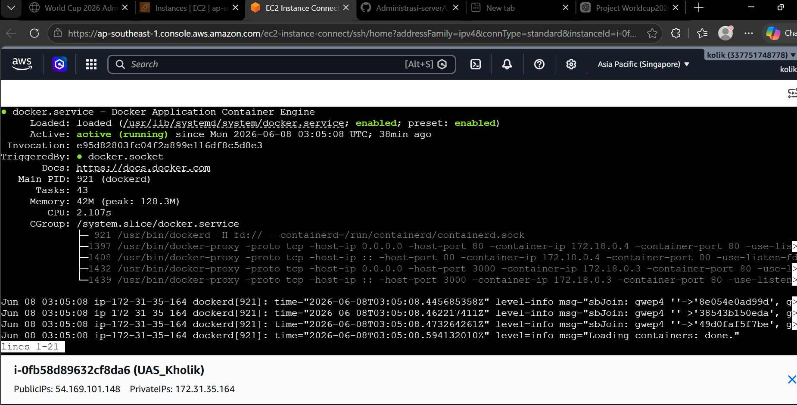
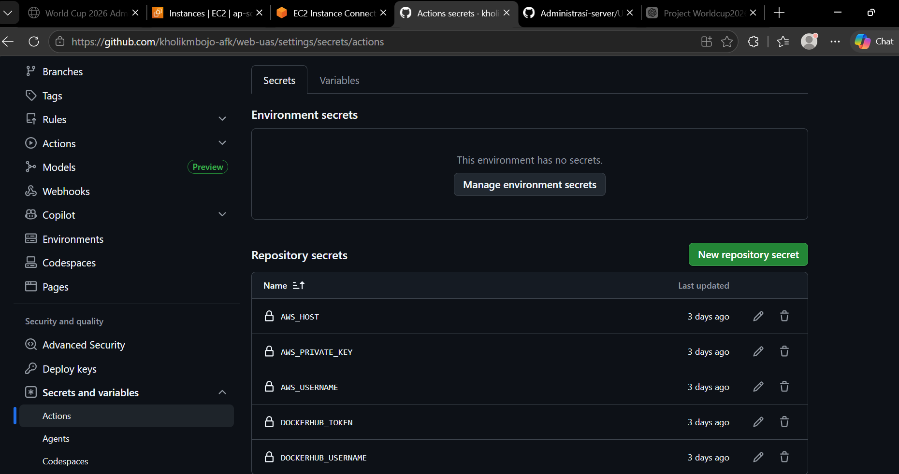

1. Membuat instance baru

2. Membuat docker baru

3. Install docker

4. Mengisi Secrets Variable di Github Actions

5. deploy web statis

6. membuat web dinamis

7. deploy web dinamis,dan pastikan databsenya konek

