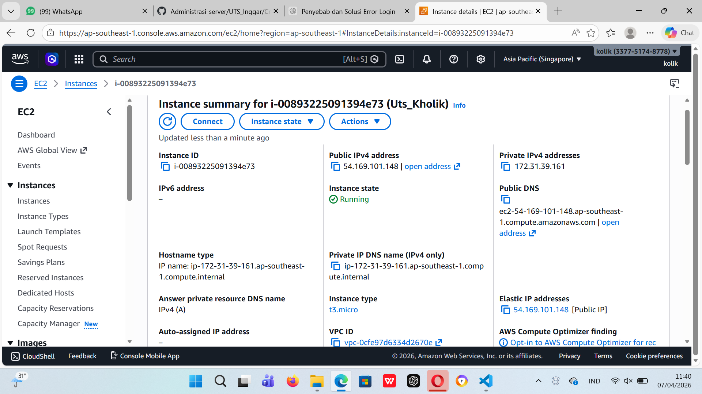
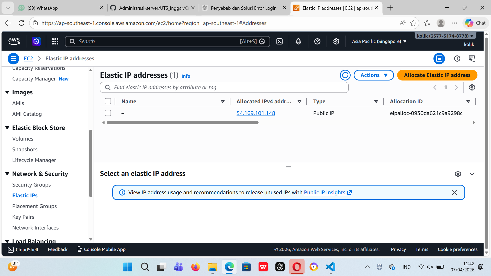
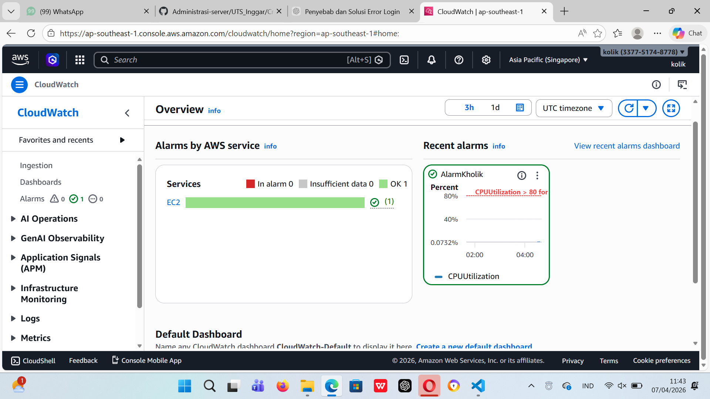
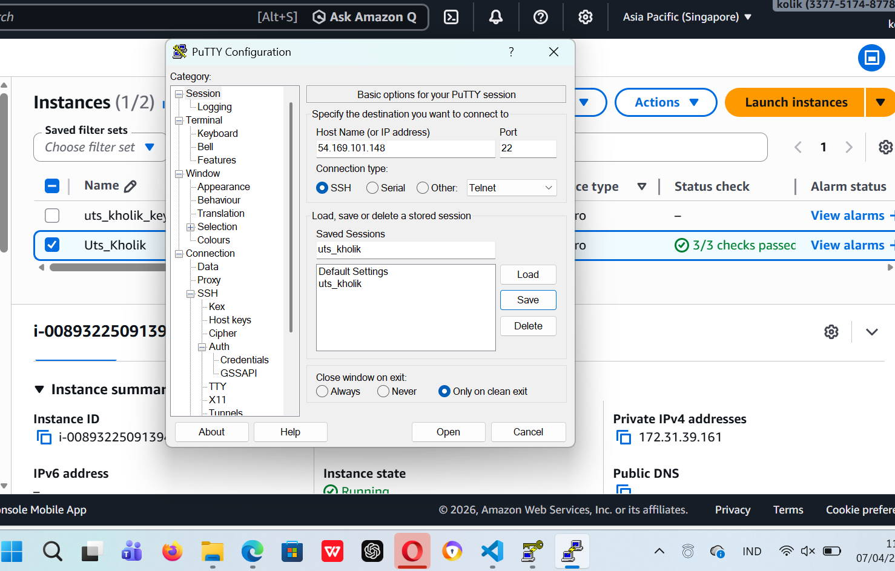
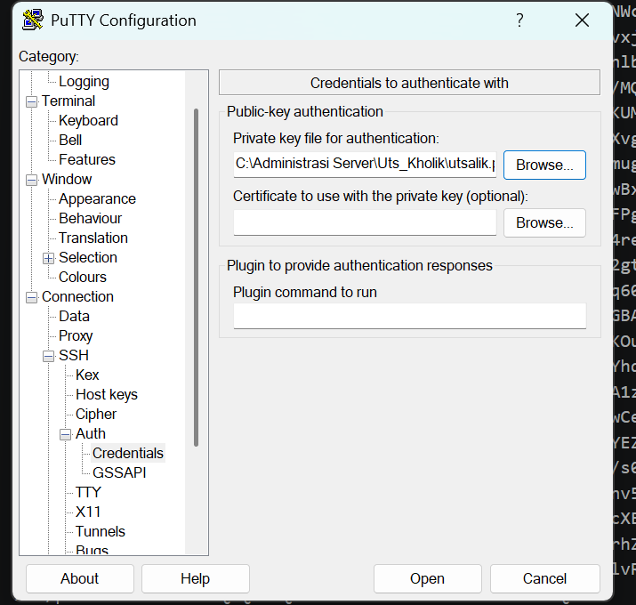
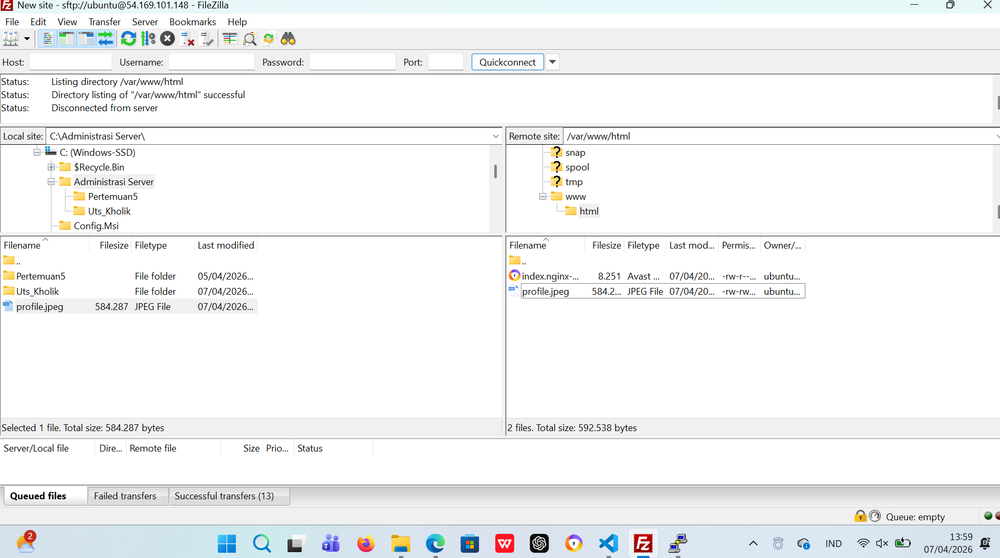
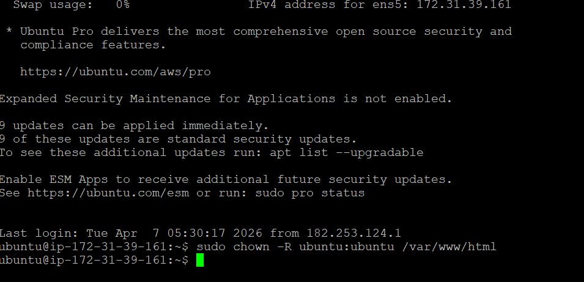
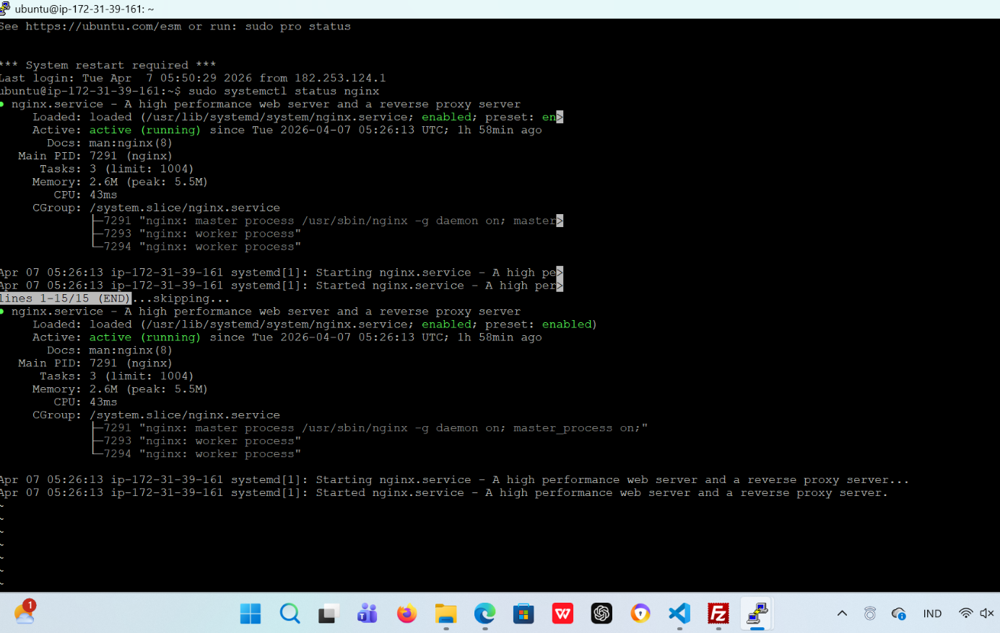
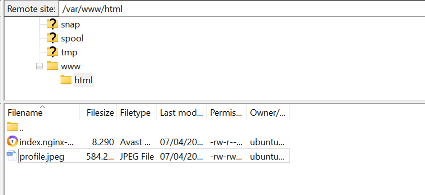
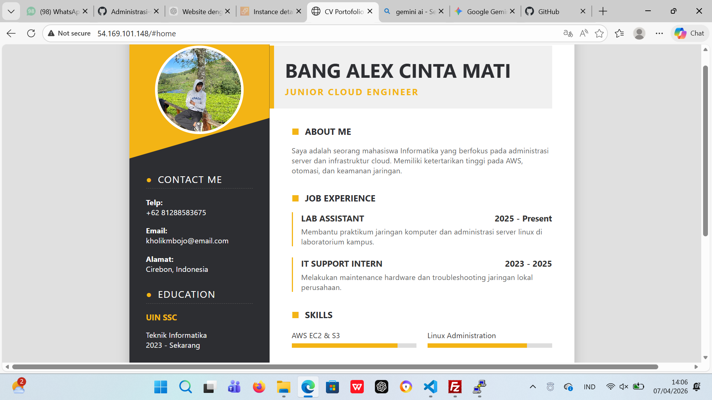

1. setup dan buat insatance baru

2. membuaat key dan seting jaringan

3. cek masih root dan ubah jadi ubuntu-ubuntu

4. intaks: sudo chown -R ubuntu:ubuntu /var/www/html

5. status nginx

6. Cek kembali di file ze dan berhasil

7. Ubah Index.html menjadi website portofolio
