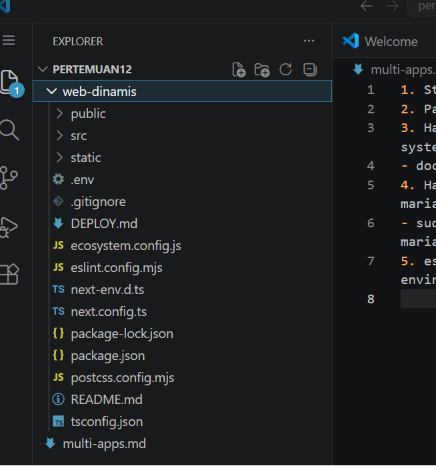
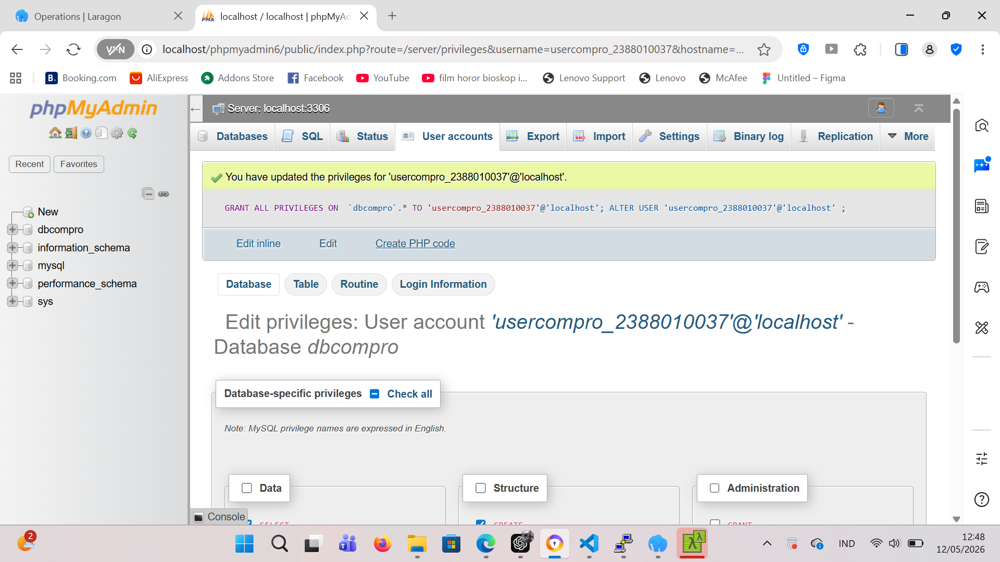
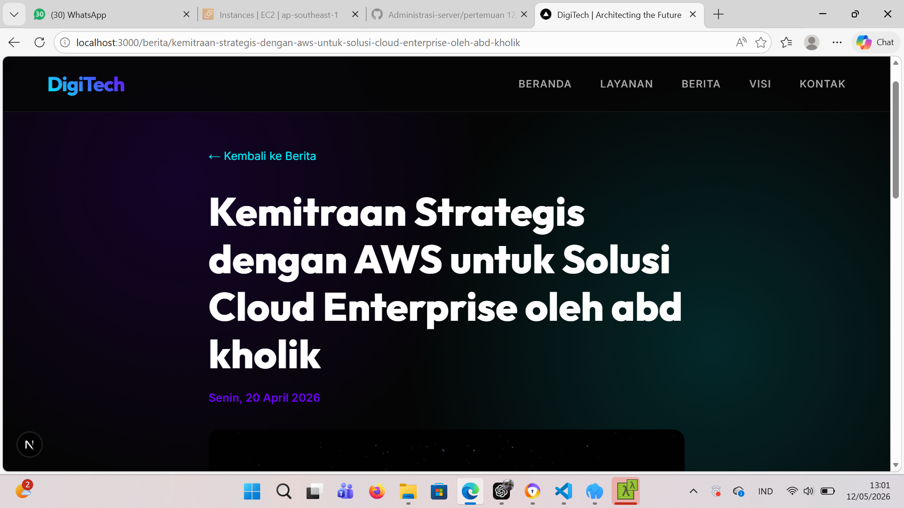

1. Start instances AWS
2. Paching OS -> sudo apt-get update && sudo apt-get upgrade
3. Hapus Layanan nginx -> sudo systemctl stop apache2 && sudo systemctl disable apache2 -> sudo apt remove apache2
- docker ps -la
4. Hapus layanan Mariadb dan uninstall -> sudo systemctl stop mariadb && suddo systemctl desable mariadb
- sudo apt auto-remove mariadb-server -> systemctl status mariadb mariadb-client mariadb-common
5. esting Next.JS + db menggunakan user bukan root pada local environment

- Klik user yang sudah di buat -> pilih database -> pilih dbcompro -> terus klik all -> go

- sesuaikan file .env
- open terminal -> cd web-dinamis
- npm i
- npm run dev -> cek website localhost

