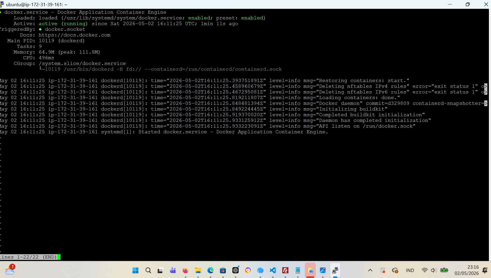
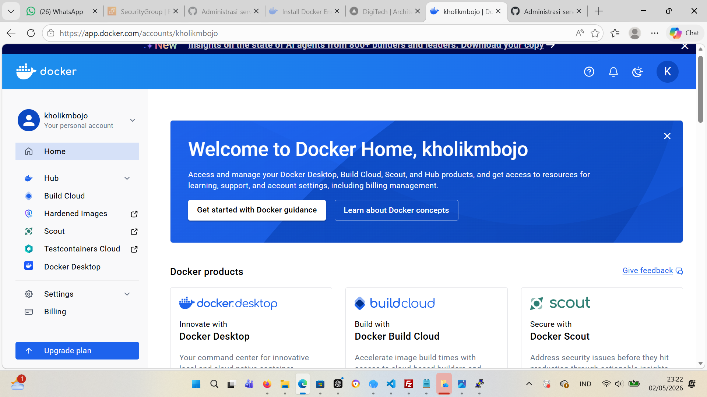
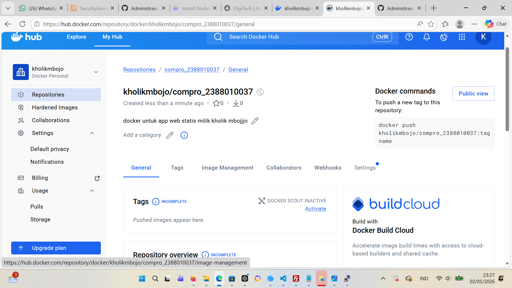
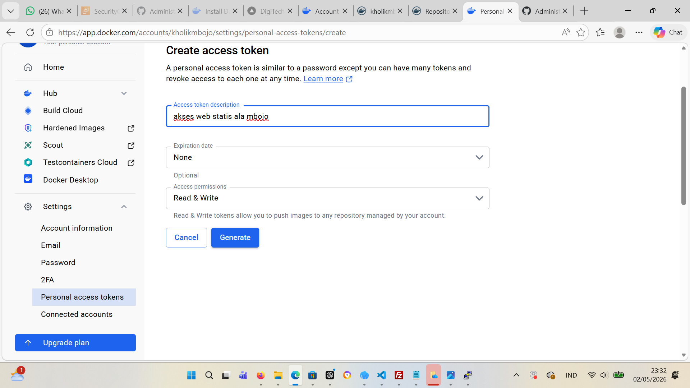
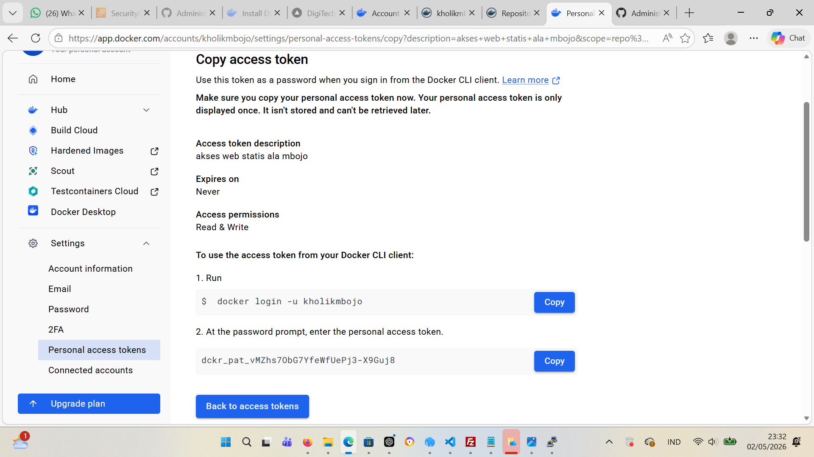
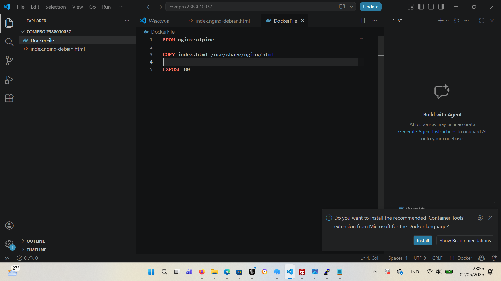
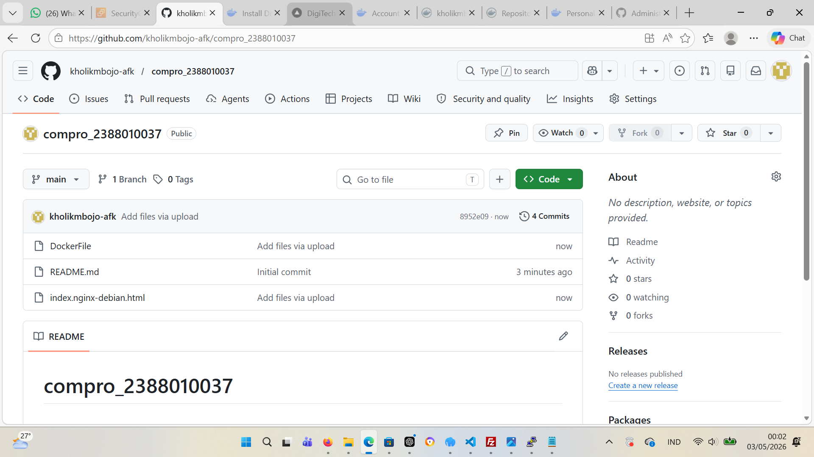

1. install based docker dokumen https://docs.docker.com/engine/install/ubuntu/

2. Registrasi Docker Hub

URL -> https://hub.docker.com
Continue with Github

3. Create Repository for Docker

- Klik menu -> Hub -> Repositories
- Klik Tombol New Repositoories
- Isi Nama repo dengan format compro_nim dan deskripsinya Docker untuk Web App Compro Statis Milik Muhammad Inggar
- Pastikan Public

4. Create Token Access

Klik Profile -> Account Setting -> Personal Access Token
Klik Generate new Token
Isi deskripsi
expiration -> None
Access Permission -> Read & Write

5. Create Projek di Lokal

Buat new folder 'compro_nim'
masuk filezilla -> download file index.html -> masukan ke dalam folder compro_nim
Buat file Dockerfile dengan isi sebagai berikut FROM nginx:alpine COPY index.html /usr/share/nginx/html EXPOSE 80

6. Push Projek ke github

Bikin Repositprie baru 'compro_nim'
upload/push folder compro_nim

