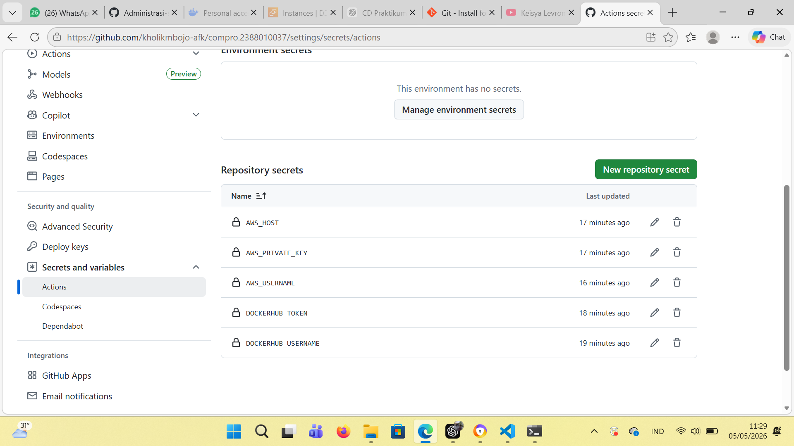
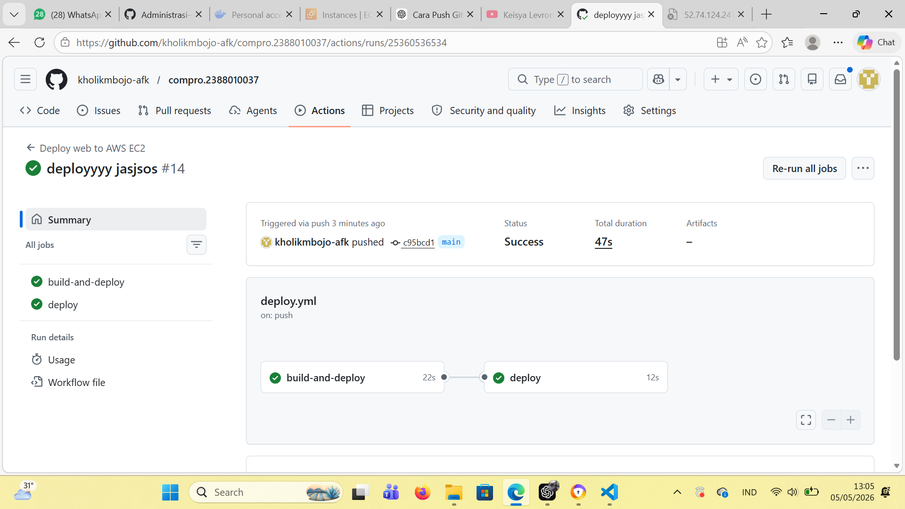

Moderenisasi CI/CD

1. Mengisi Secrets Variable di Github Actions

Buka repo di github
Klik sttings -> Secret and Variables -> Action
Klik New Repo secret
Isi Nama = DOCKERHUB_USERNAME dan Value = username akun docker
Klik New Repo Secret
Isi Nama = DOCKERHUB_TOKEN dan Value = token akun docker
Klik New Repo Secret
Isi Nama = AWS_HOST dan Value = ip Public EC2 Instance
Klik New Repo Secret
Isi Nama AWS_USERNAME dan Value = ubuntu
Klik New Repo Secret
Isi Nama = AWS_PRIVATE_KEY dan Value = file.pem (berisi tanda petik di awal dan di akhir juga)

2. ebelum melakukan commit dan synch pada File

Pastikan sudah disable apache2 -> sudo systemctl disable apache2
Pastikan sudah stop apache2 -> sudo systemctl stop apache2
Pastikan user ubuntu sudah ditambahkan ke docker -> sudo usermod -aG docker ubuntu
Baru lakukan commit dan push ke Github

3. LAKUKAN UPDATE TITTLE PADA INDEX HTML LALU PUSH
