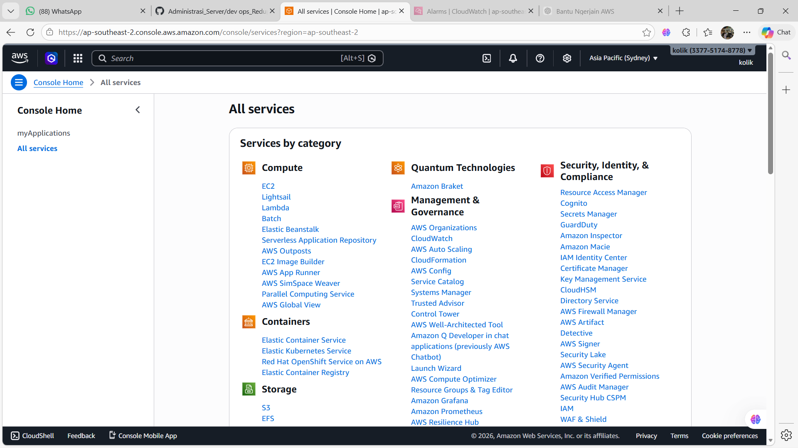
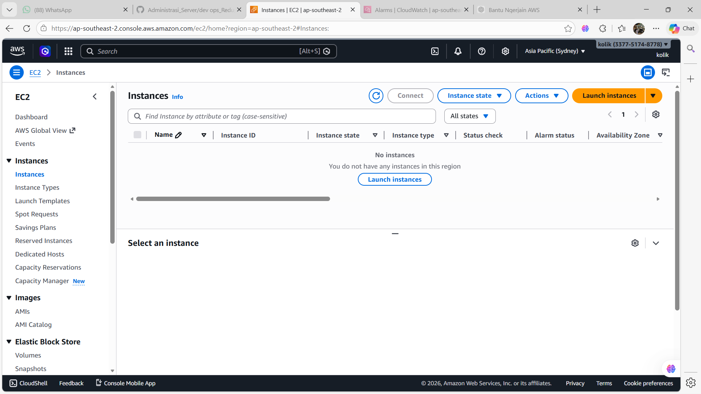
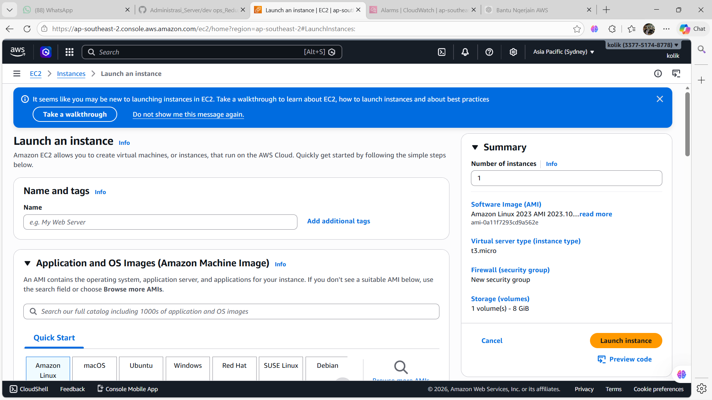
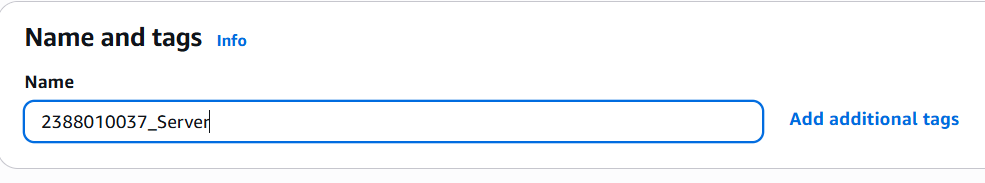
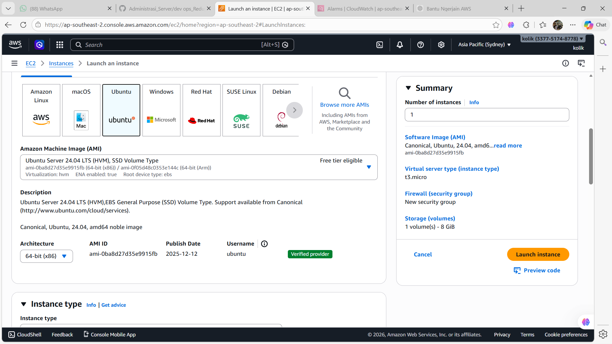
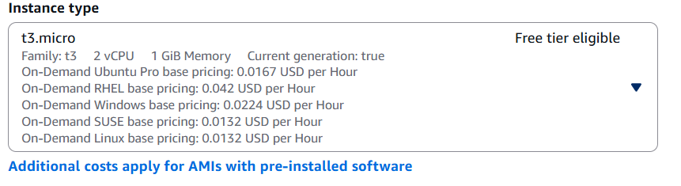
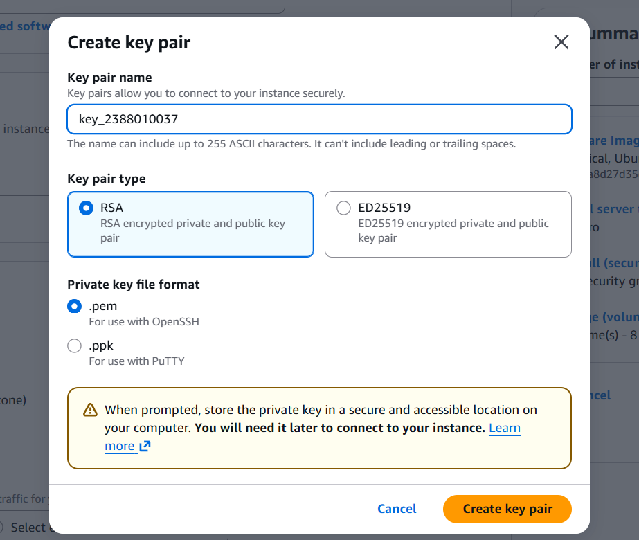
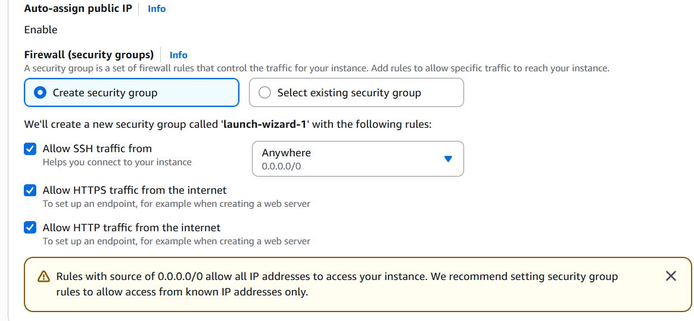
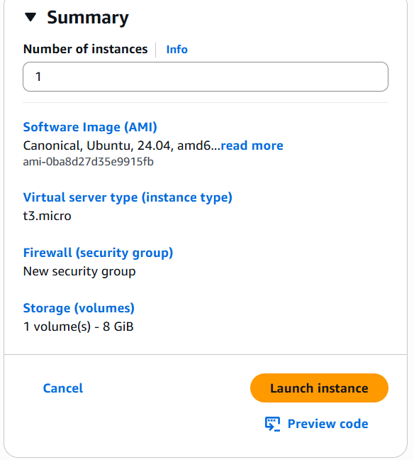
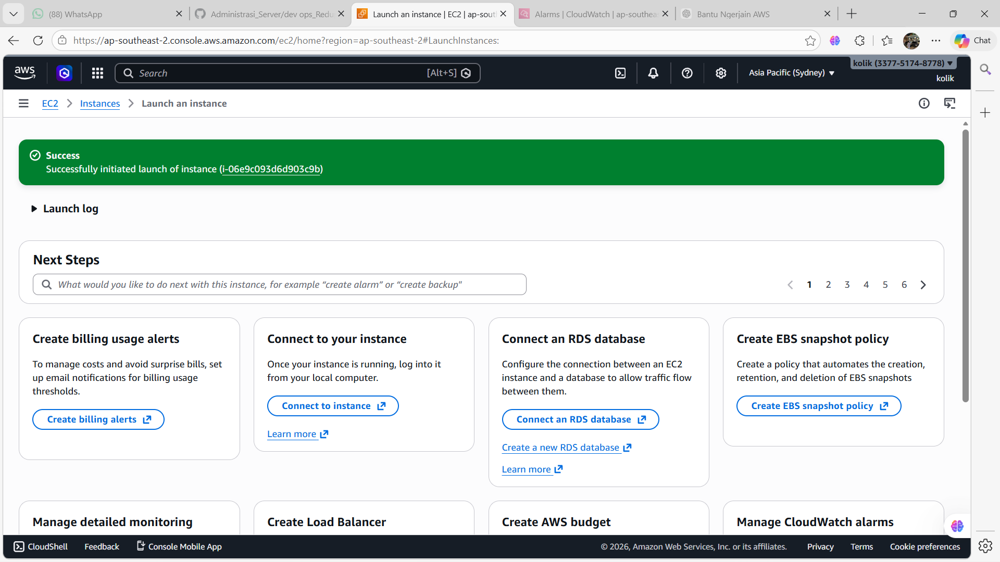

#step by step how to created ec2

1.click ec2

2.click instances

3.click launch instances

4.created your name

5.pilih ubuntu

6.pilih resourch intens

7.membut key pairr, pilih nama key pair, pilih rsa

8.setting kebijakan keaman-Allow hhtps

9.pilih launch intance

10.succees

