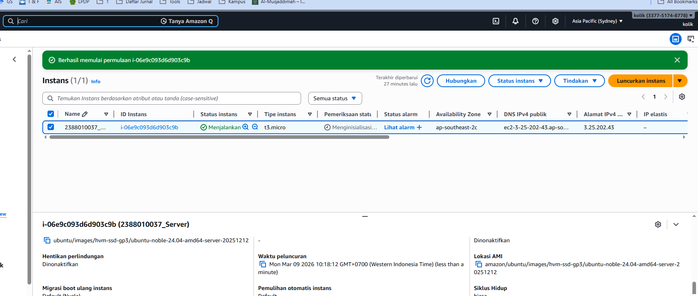
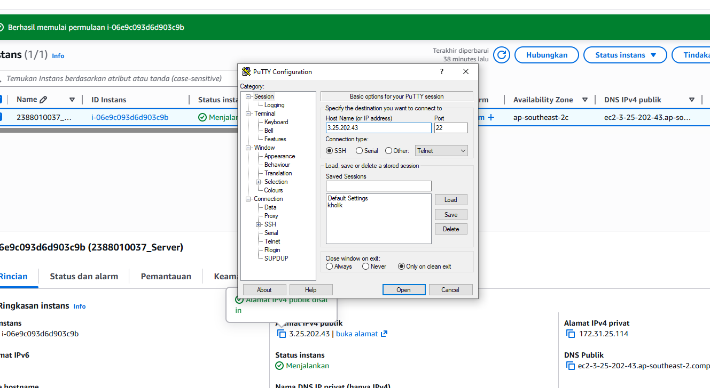
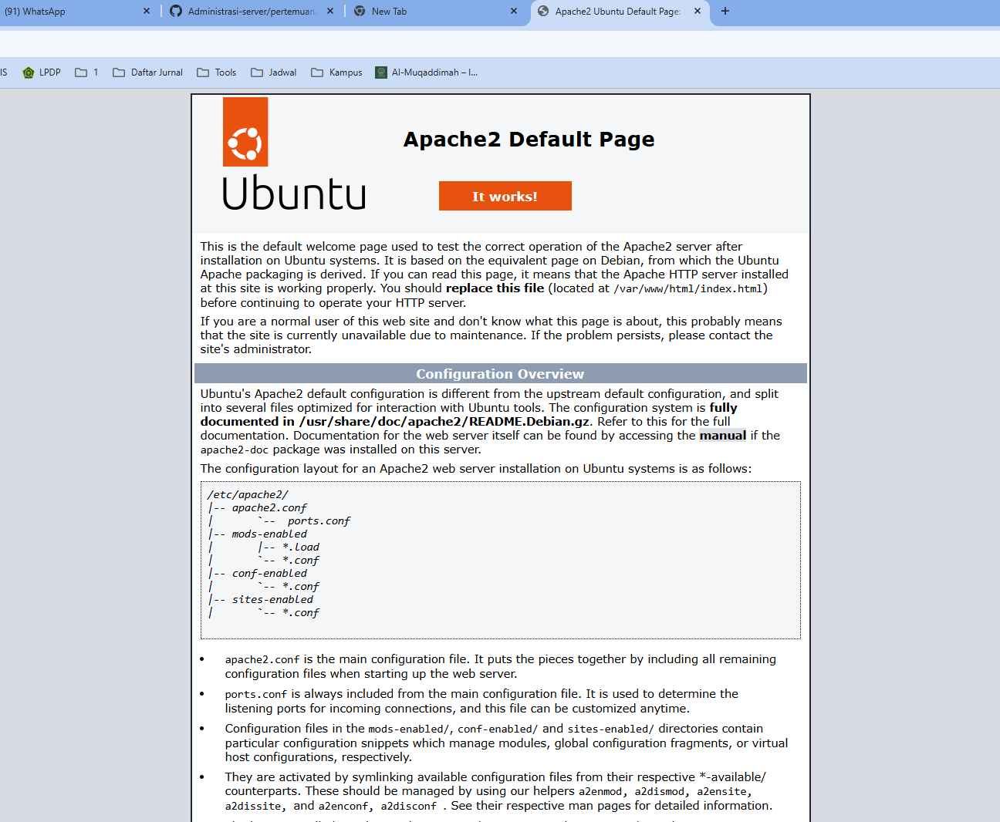
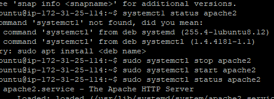
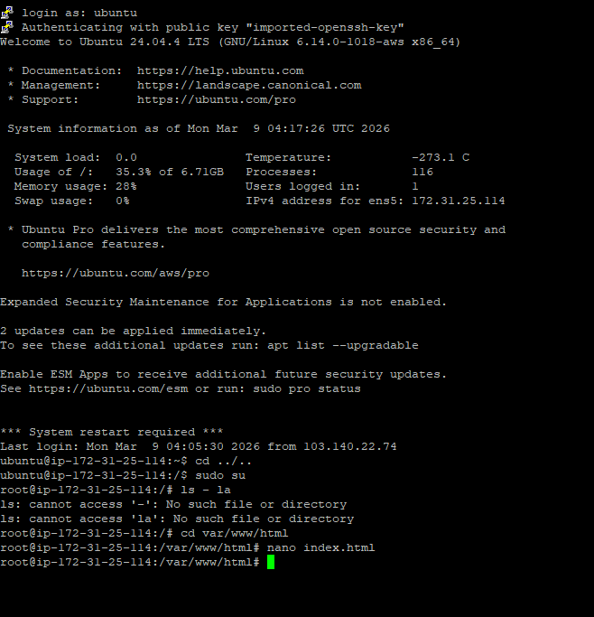
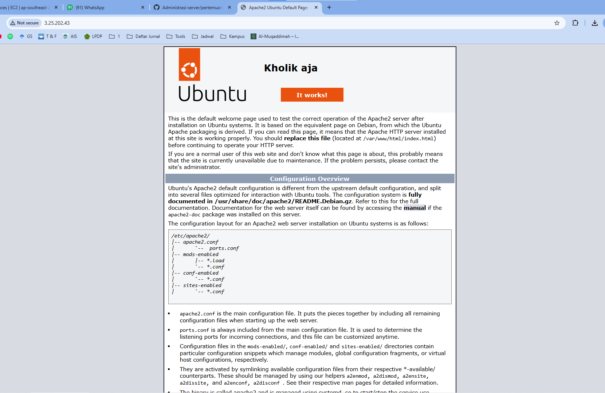

1. start instance 
2. update bagian ip adres  
3. cek web server(systemctl status apache2) 
4. sudo systrmctl apache2(menghentikan web server) 
5. nano index.html untuk costum nama 
5. berhasil 

