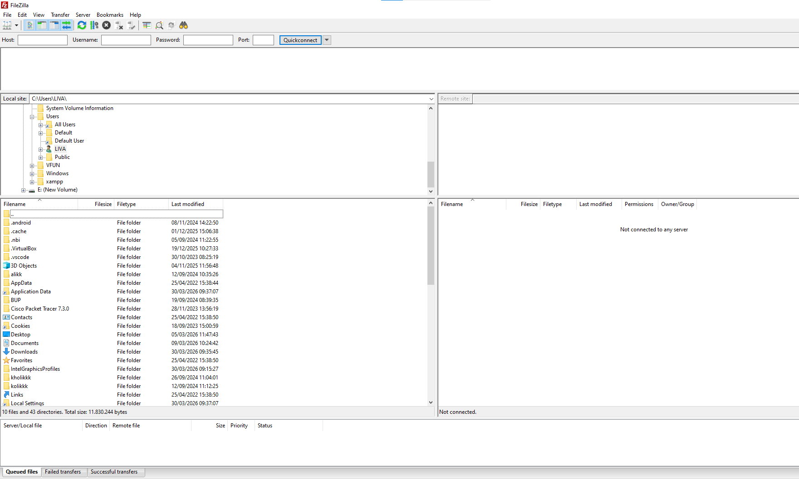
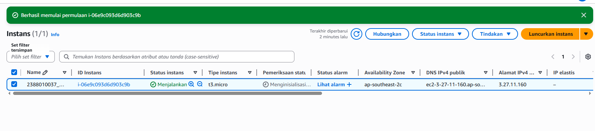
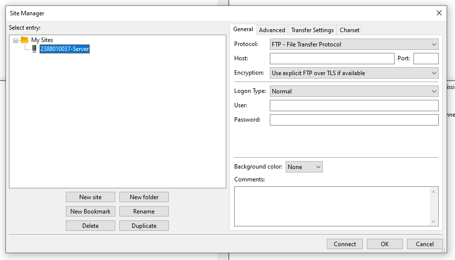
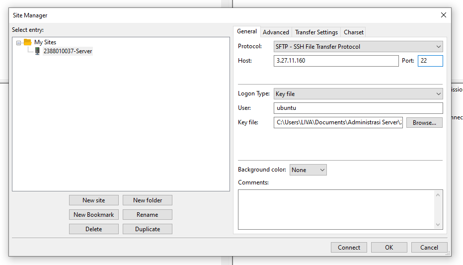
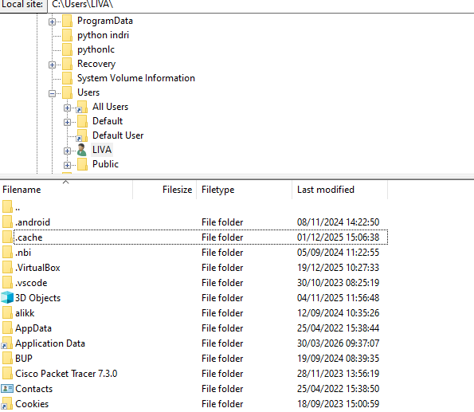
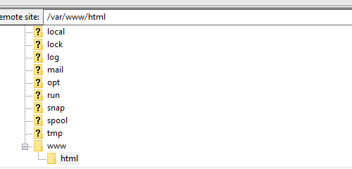
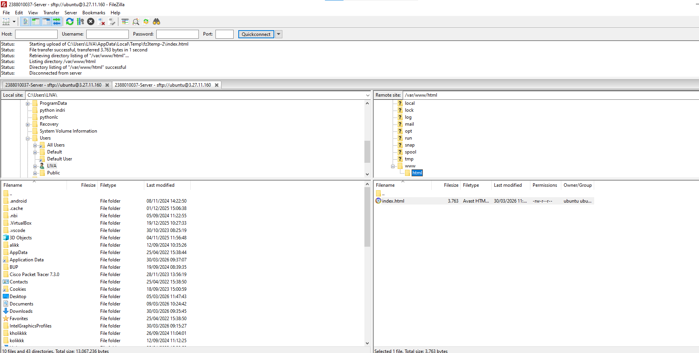
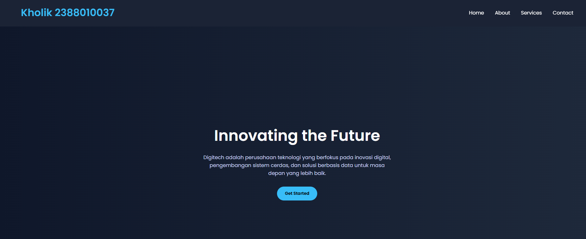

1. Memilih tools Migrasi File, misal kita gunakan Filezilla
Unduh dan install Filezilla https://filezilla-project.org/download.php?type=client
Buka FileZila

Mengaktifkan Serves Local

Kembali ke filezilla
klik file
klik site meneger
klik new site
berikan nama nim_server

logon type

2. pada dashboad utama filezila

panel kiri > file local

3. Berhasil save index html

4. membuka web, dan berhasil

