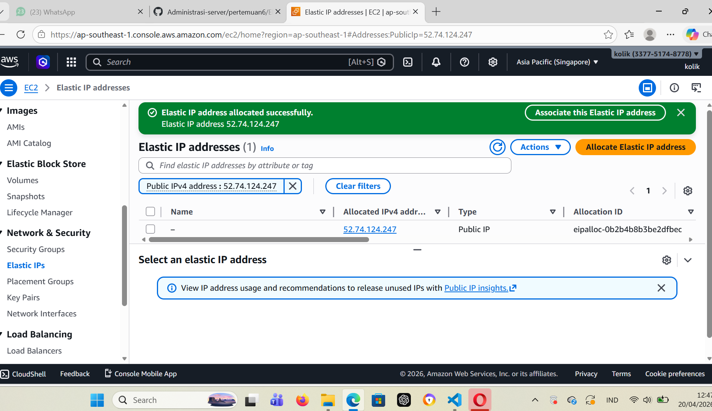
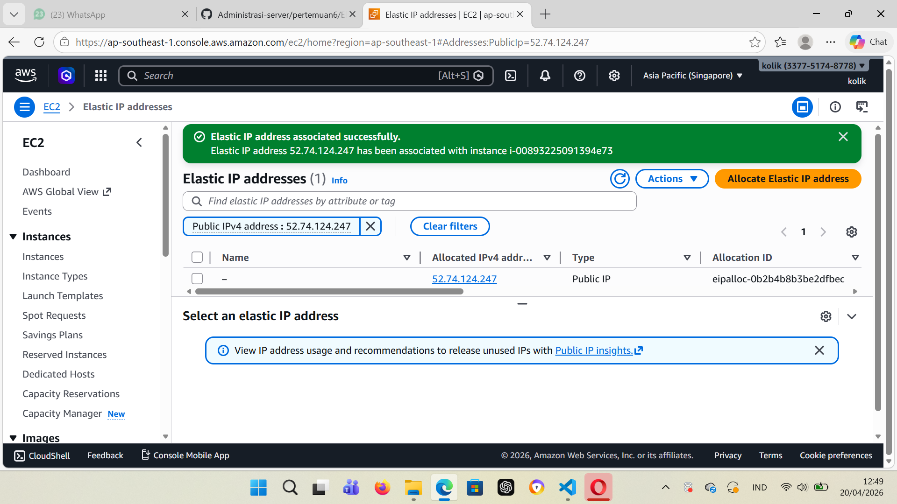
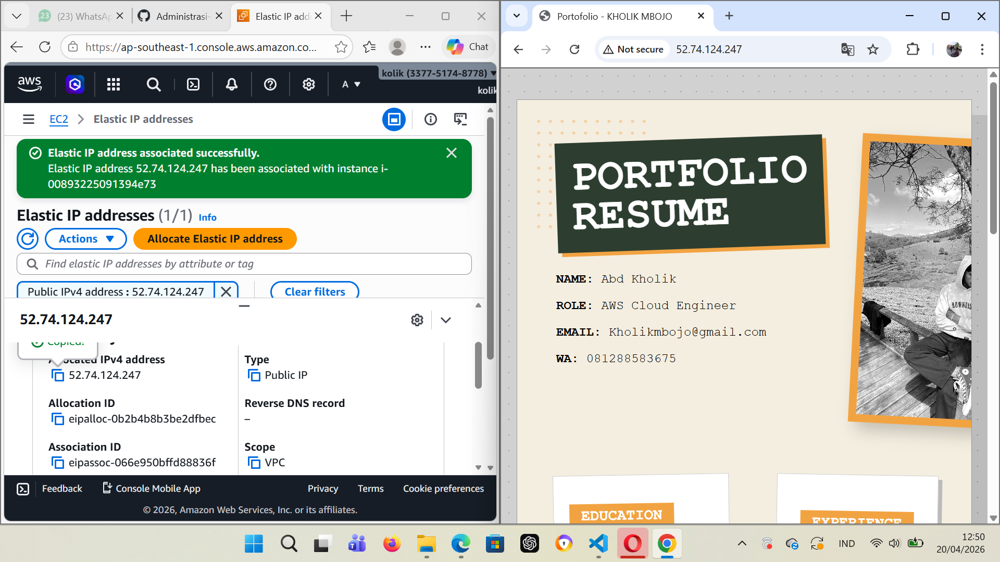

## Membuat elastic ip
1.Jalankan instance
2.ke menu netword & Security, pilih elastic ip
Klik menu Allocate Elastic Ip Adress

3. Assosiciet kan elastic ip segera mugkin (> 1 jam akan kena cost)
Klik nama IP nya
Pilih Action > Associate Elastic IP address

berhasil mebuat ip

